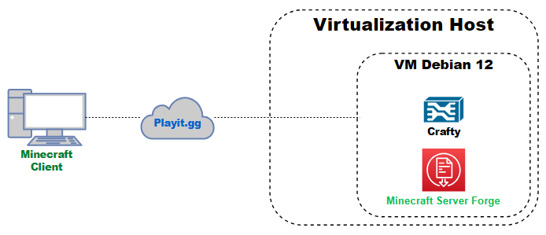

# Servidor Minecraft Modificado en Entorno Virtualizado

## Descripción

Este proyecto consiste en el despliegue de un **servidor de Minecraft con mods (Forge)** dentro de un entorno virtualizado, utilizando herramientas de administración web, automatización de tareas y acceso remoto seguro sin necesidad de abrir puertos en el router.

El objetivo es simular un entorno real de infraestructura IT aplicando conceptos de virtualización, redes y gestión de servicios.

---

## Tecnologías utilizadas

- Debian 12 (sin interfaz gráfica)
- VirtualBox
- CasaOS
- Crafty Controller
- Playit.gg
- Minecraft Forge + Mods
- Modrinth (gestión de cliente)

---

## Arquitectura del sistema
```
PC anfitrión (host)
│
└── VirtualBox
└── Máquina virtual (Debian 12)
├── CasaOS
│ └── Gestión de servicios
├── Crafty Controller
│ └── Servidor Minecraft Forge
└── Playit.gg
└── Acceso remoto
```
---

## Diagrama de arquitectura



---

## Funcionalidades principales

- Servidor Minecraft con mods (Forge)
- Gestión mediante interfaz web (Crafty + CasaOS)
- Reinicio automático en caso de fallo
- Backups automáticos cada 6 horas
- Acceso remoto sin configuración de router (Playit.gg)
- Sincronización de mods cliente-servidor mediante Modrinth

---

## Pruebas y validación

- Conexión local y remota funcional  
- Carga correcta de mods y generación de mundo  
- Sistema de reinicio automático operativo  
- Backups verificados y restaurables  

---

## Problemas comunes resueltos

- Incompatibilidad de mods entre cliente y servidor  
- Archivos `.jar` corruptos  
- Errores por falta de mods en mundos existentes  
- Configuración de acceso remoto sin port forwarding  

---

## Documentación

La documentación completa del proyecto se encuentra en:
```
/docs/es/proyecto.pdf
```

Incluye:

- Instalación paso a paso  
- Configuración completa  
- Arquitectura  
- Resolución de problemas  
- Conclusiones  

---

## Objetivos del proyecto

- Aplicar conocimientos de virtualización  
- Implementar servicios en entorno Linux  
- Gestionar un servidor real con usuarios  
- Automatizar tareas de mantenimiento  
- Resolver problemas técnicos reales  

---

## Valor del proyecto

Este entorno demuestra habilidades en:

- Administración de sistemas Linux  
- Virtualización  
- Redes (NAT, túneles)  
- Gestión de servicios  
- Resolución de errores reales  

---

## Lecciones aprendidas

- Importancia de la compatibilidad entre cliente y servidor en entornos con mods
- Gestión de errores a través de logs (debugging en Forge)
- Impacto de la virtualización en rendimiento y recursos
- Uso de túneles seguros frente a port forwarding tradicional
- Necesidad de backups automáticos en servicios persistentes

---

## Seguridad

- No se expone el servidor directamente a Internet
- Uso de túneles seguros mediante Playit.gg
- Acceso controlado a servicios internos mediante NAT

---

## Notas

Este proyecto está orientado como práctica de **homelab** y puede escalarse a entornos más complejos con mayor número de usuarios o infraestructura dedicada.
